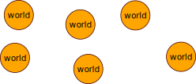
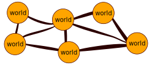
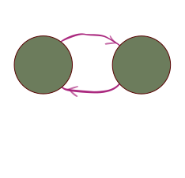

# Reinforcement Learning.

---
<!-- header: Introduction -->

## What is  Reinforcement Learning</snap>?

---

## What is  Reinforcement Learning</snap>?

It is the set of technics for achieving "______________________________". 

---

## What is  Reinforcement Learning</snap>?

It is the set of technics for achieving " control over the otherworld ". 

---

## What is  Reinforcement Learning</snap>?

It is the set of technics for achieving " Control over another world ". 

* World view. 
* Connection over worlds. 
* Control over another world. 
  
---
<!-- header: Worlds view -->
## Worlds view. 

---

Each world can be a: 

* Arduino
* brain
* computer. 
* mobile
* Turing machine. 

i.e. any Information Processing System. 

---
<!-- header: "Connection between worlds." -->

## The connection between worlds. 

---

## Ex.

* IO devices.
* Arms.
*  wheels.

<!-- The separation is hard I think anything that changes can become here. -->

---
<!-- header: Connected worlds -->

#### So now we have a Connected worlds. 

## let's look from **Inside a world.**  

---
<!-- header: From Inside a World -->
##  From Inside a World

---

Since these worlds have their **dynamic laws**. we can see some **relation** between the controller and Oberver includinganother **delay**. 

####  We want to achieve some good observers through these controls.

--- 
<!-- header: Control over another World. -->
## Control over another World. 

<snap style="color:red"> Why do we want to control something?  </snap>
Because we want something and we want more of it.

I don't know the origin of this need. but in this case, we have to tell explicitly what we want to achieve with this control. 

#### So we have to give a **Reward function**. 

---
<!-- header: What is RL -->

## What is  Reinforcement Learning</snap>?

It is the set of technics for achieving " Control over another world ". 

* World view. 
* Connection over worlds. 
* Control over another world. 
  * Reward function. 

---

## What is  Reinforcement Learning</snap>?

